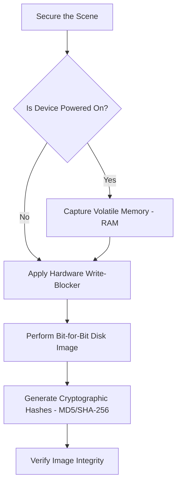

Listen up. If you alter a single byte of the original data state during an acquisition, you haven't just failed your job—you've destroyed the case. Acquiring digital evidence isn't about clicking around a live system like a clueless end-user. We are here to master the capture of disk images and volatile memory securely. Do it exactly right, or don't do it at all.

Back in the early 1990s, amateurs conducted "live analysis" by poking around the device in question as anyone else would [A Guide to Digital Forensics and Cybersecurity Tools](https://www.forensicscolleges.com/blog/resources/guide-digital-forensics-tools). As devices became infinitely more complex, this became a massive liability. Today, if you aren't using specialized hardware and software to extract data *without* damaging or modifying it, you are incompetent. 

## The Acquisition Protocol

Get this workflow through your head. This is the only acceptable path from a live scene to a verified forensic image.

> [!DANGER]
> The primary goal of your investigation is to create a repeatable and defensible process. These tools and procedures exist to maintain evidence integrity, which is the absolute bare minimum requirement for ensuring your findings are admissible in court [6 Best Digital Investigation Software Tools](https://www.crosstrax.co/digital-investigation-software-tools/). 

## Standard Operating Procedure

Do not deviate from these steps. Your personal theories on data extraction do not matter here.

<Steps>
<Step title="Capture Volatile Memory First">
If the machine is running, **do not pull the plug immediately**. You will destroy encryption keys, active network connections, and running malware processes. Use a trusted memory acquisition tool deployed from a sterile USB drive to dump the RAM.
</Step>
<Step title="Implement Strict Write-Blocking">
Once powered down, physically remove the storage media. Never plug a suspect drive directly into your forensic workstation without a hardware write-blocker bridging the connection. If your OS mounts the drive and alters the timestamps, you're done.
</Step>
<Step title="Create a Bit-for-Bit Image">
Logical copies (dragging and dropping files) are for amateurs. You will create a physical, bit-for-bit image (e.g., `.E01` or `dd` format) that captures every allocated file, unallocated sector, and slack space on the drive.
</Step>
<Step title="Hash and Verify">
Generate an MD5 or SHA-256 hash of the original drive and compare it against the hash of your forensic image. If they do not match perfectly, your acquisition is garbage. Start over.
</Step>
</Steps>

## Approved Forensic Tooling

You are only as good as the tools you know how to use. The industry has moved past freeware toys into enterprise-grade extraction platforms. Learn them.

| Tool | Primary Function | The Hard Truth |
|----------|----------|----------|
| **OpenText EnCase Forensic** | Enterprise Investigation | The long-standing industry standard for complex, wide-ranging investigations [6 Best Digital Investigation Software Tools](https://www.crosstrax.co/digital-investigation-software-tools/). Learn it if you want to work in the big leagues. |
| **Magnet AXIOM** | Mobile & Cloud | Extracts system logs, deleted files, and handles encrypted information seamlessly [A Guide to Digital Forensics and Cybersecurity Tools](https://www.forensicscolleges.com/blog/resources/guide-digital-forensics-tools). |
| **Belkasoft X** | Encrypted Data Extraction | Fast search and filtering features. Regularly updates to stay compatible with the latest devices [A Guide to Digital Forensics and Cybersecurity Tools](https://www.forensicscolleges.com/blog/resources/guide-digital-forensics-tools). |
| **Autopsy** | Open-Source Forensics | A free, open-source platform that simplifies investigations [6 Best Digital Investigation Software Tools](https://www.crosstrax.co/digital-investigation-software-tools/). You have zero excuses for not having a capable tool. |
| **Cyber Triage** | Automated Incident Response | Automates the process to put data into a standard format and filter the noise [6 Best Digital Investigation Software Tools](https://www.crosstrax.co/digital-investigation-software-tools/). Use it to ensure your sloppy work remains defensible. |

> [!TIP]
> Stop relying entirely on automated parsers. Tools like **IBM Security QRadar SIEM** and **ExtraHop** are excellent for network forensics and log management, but if you don't understand the underlying hex data, you are just a button-pusher. Verify your tool's output manually.