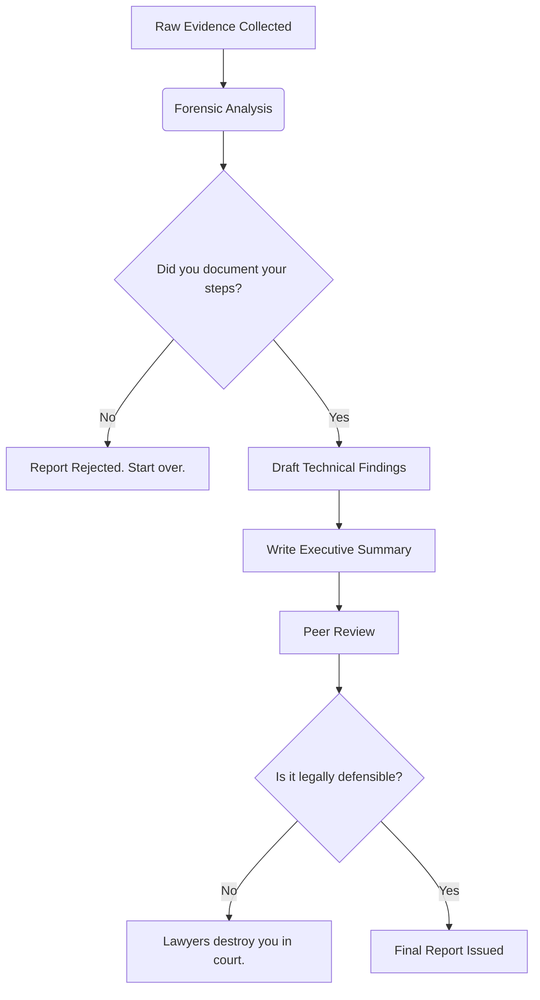

Listen up. Your forensic report isn't a creative writing exercise, and nobody cares about your feelings or how hard you worked. It is a legal document. If you fail to compile your findings into a clear, legally defensible timeline, you are wasting the client's money and setting yourself up to be humiliated by opposing counsel in court. 

Read this standard, memorize it, and stop submitting garbage reports.

## The Anatomy of a Defensible Report

If your report does not contain the following sections, clearly delineated and meticulously proofread, do not even bother submitting it for peer review. 

| Section | Purpose | Failure Consequence |
|---------|---------|---------------------|
| **Executive Summary** | Explain what happened to people who sign your paychecks. No jargon. | The board ignores your work and fires the CISO. |
| **Scope & Objectives** | Define exactly what you were authorized to touch. | You get sued for overstepping your legal bounds. |
| **Methodology** | List your tools, versions, and forensic principles used. | Opposing counsel invalidates your entire analysis. |
| **Timeline of Events** | Chronological breakdown of the attack. **Must be in UTC.** | The timeline makes no sense and the case is dismissed. |
| **Technical Findings** | The actual evidence. Hashes, registry keys, log entries. | Your claims are treated as baseless speculation. |

> [!DANGER]
> **Use UTC. Always.** If I catch you putting local time zones in a forensic timeline without explicit, documented offsets for every single entry, I will personally reject the report. The adversary doesn't care about Daylight Saving Time, and neither does the court.

## The Reporting Lifecycle

Stop winging it. Follow the standard operating procedure or find another line of work.



## How to Write the Damn Thing

Follow these steps. Do not skip them. Do not combine them.

<Steps>
<Step title="Establish the Chain of Custody">
Before you write a single word of analysis, document the hash values of your evidence images. If your `SHA-256` hashes don't match the acquisition logs, stop writing. Your evidence is tainted.
</Step>
<Step title="Draft the Technical Findings">
State the facts. Do not guess. If you found a malicious payload, document the exact file path, MACB timestamps, and the hash. 

```text
File Path: C:\Windows\System32\drivers\svchost.exe
Created:   2023-10-14 08:12:45 UTC
Modified:  2023-10-14 08:12:45 UTC
SHA-256:   e3b0c44298fc1c149afbf4c8996fb92427ae41e4649b934ca495991b7852b855
```
</Step>
<Step title="Construct the Timeline">
Build a chronological sequence of events. Correlate your endpoint artifacts with network logs. If there is a gap in the timeline, state that there is a gap. Do not fabricate a narrative to fill missing data.
</Step>
<Step title="Write the Executive Summary Last">
Write this for a CEO who has exactly three minutes to read it. Who did it (if known), what was stolen, how did they get in, and how do we stop it from happening again. Keep it under one page.
</Step>
</Steps>

## Citing Evidence

When you make a claim, back it up. If you say an attacker executed a command, you better show the exact log entry or artifact that proves it. 

Do not just say "The attacker dumped credentials." Write exactly how it was done, citing the specific Event ID or artifact:

> [!NOTE]
> **Correct Citation Example:**
> "At `2023-10-14 09:15:22 UTC`, the threat actor executed `procdump.exe` to extract the memory of `lsass.exe`. This is corroborated by Windows Security Event ID 4688 (Process Creation) on host `SRV-DC-01`, showing the command line arguments: `procdump.exe -accepteula -ma lsass.exe lsass.dmp`."

> [!WARNING]
> **Tool Output is Not Evidence**
> Do not just paste 50 lines of raw Volatility or Plaso output into the middle of your report. Put the raw output in the appendices. Summarize the *meaning* of the output in the findings section. The judge doesn't want to read your terminal stdout.