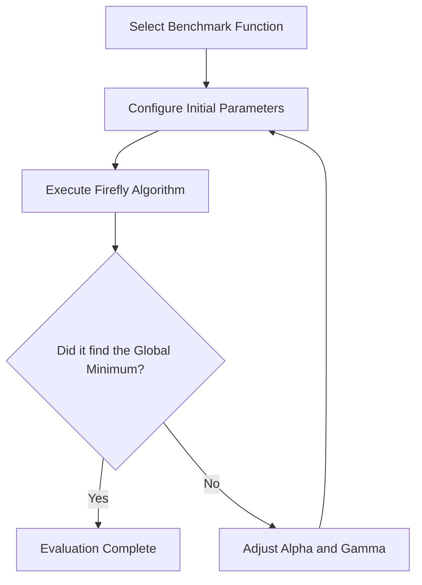

Evaluating the performance of your Firefly algorithm is a critical step in the optimization process. By testing your setup against standard multidimensional benchmark functions, you can verify its accuracy, understand its behavior, and tune its parameters for real-world applications.

## Understanding the Benchmark Results

When evaluating the algorithm, we compare the minimum value it finds against the known global minimum of a standard mathematical function. The success of the algorithm heavily depends on three core parameters:

*   **$\alpha$ (Alpha):** The randomization parameter.
*   **$\beta_0$ (Beta zero):** The maximum attractiveness (when the distance between fireflies is zero).
*   **$\gamma$ (Gamma):** The light absorption coefficient.

> [!NOTE]  
> A lower $\gamma$ value (e.g., 0.1) often allows fireflies to see each other from further away, which can significantly improve the algorithm's ability to converge on the true global minimum in complex landscapes.

### Sample Performance Data

The table below demonstrates how different parameter configurations affect the algorithm's performance across various multidimensional test functions. Notice how tuning $\alpha$ and $\gamma$ drastically changes the final results.

| Benchmark Function | Dimensions | Parameters ($\alpha$, $\beta_0$, $\gamma$) | Minimum Found | Final Coordinates |
| :--- | :--- | :--- | :--- | :--- |
| **Generic Function** | 4-D | 1.0, 1.0, 1.0 | 5,050.07 | `(1.11, -5.48, 0.60, 1.78)` |
| **Generic Function** | 4-D | 0.5, 1.0, 0.1 | 0.0268 | `(0.91, 0.82, 1.08, 1.17)` |
| **Zakharov** | 5-D | 1.0, 1.0, 0.1 | 0.0000 | `(0.0009, -0.0018, -0.0008, 0.0011, 0.0006)` |
| **Zakharov** | 5-D | 1.0, 1.0, 1.0 | 19.7327 | `(1.49, 2.78, -0.40, -1.56, -0.50)` |
| **Zakharov** | 5-D | 0.5, 1.0, 0.1 | 0.0000 | `(0.00, 0.00, 0.00, 0.00, 0.00)` |
| **Styblinski-Tang** | 4-D | 1.0, 1.0, 0.1 | -142.527 | `(2.74, -2.90, -2.90, -2.90)` |

> [!TIP]
> Look at the **Zakharov (5-D)** results. When $\gamma$ was set to `1.0`, the algorithm got stuck at a local minimum of `19.7327`. Lowering $\gamma$ to `0.1` allowed it to successfully find the true global minimum of `0.0000`.

## How to Evaluate Your Own Runs

To benchmark your own implementation of the Firefly algorithm, follow a structured evaluation loop. 

<Steps>
<Step title="Select a benchmark function">
Choose a standard mathematical function with a known global minimum. Popular choices include the Zakharov or Styblinski-Tang functions because their landscapes are well-documented.
</Step>
<Step title="Set initial parameters">
Start with standard baseline parameters. A common starting point is $\alpha = 1.0$, $\beta_0 = 1.0$, and $\gamma = 1.0$.
</Step>
<Step title="Run the optimization">
Execute the algorithm and record both the lowest value found (the minimum) and the coordinates where it was found.
</Step>
<Step title="Compare and adjust">
Compare your result to the known global minimum. If your result is significantly higher, your fireflies likely got trapped in a local minimum. Reduce $\alpha$ (e.g., to `0.5`) and $\gamma$ (e.g., to `0.1`) and run the test again.
</Step>
</Steps>

## Standard Benchmark Functions

If you are new to optimization benchmarking, here is a quick overview of the test functions referenced in the data above.

<Accordion>
<AccordionTab title="Zakharov Function">
The Zakharov function is widely used to test optimization algorithms because it has no local minima, but its steep valleys make it difficult for algorithms to converge precisely on the global minimum. The true global minimum is always `0`, located at the origin `(0, 0, ..., 0)`.
</AccordionTab>
<AccordionTab title="Styblinski-Tang Function">
The Styblinski-Tang function is used to test an algorithm's ability to navigate a landscape with multiple local minima. In a 4-D space, the global minimum is approximately `-156.66`, located at `(-2.9035, -2.9035, -2.9035, -2.9035)`. As seen in our data, the Firefly algorithm successfully approximates this with a result of `-142.527`.
</AccordionTab>
</Accordion>

## Next Steps

Now that you know how to evaluate your results, you can start fine-tuning the algorithm for your specific use case.

<Card title="Parameter Tuning Guide" icon="pi pi-sliders-h" href="/docs/firefly/tuning">
Learn advanced strategies for balancing exploration and exploitation by adjusting alpha and gamma.
</Card>
<Card title="Troubleshooting Convergence" icon="pi pi-exclamation-triangle" href="/docs/firefly/troubleshooting">
Discover what to do when your fireflies get stuck in local minima.
</Card>